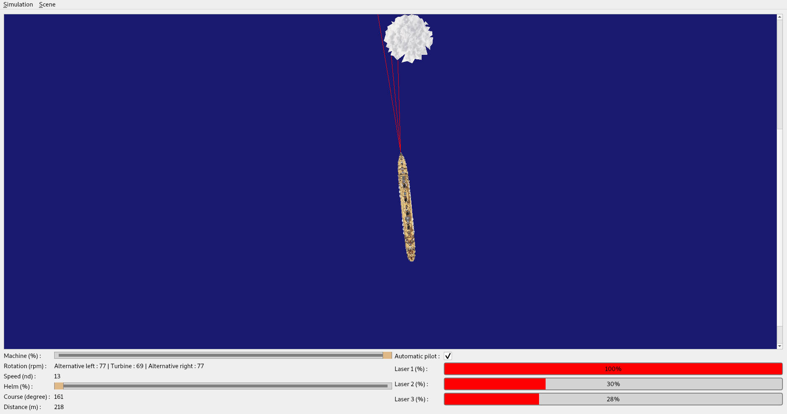

# Fuzzy logic framework

This project exploits the potential of fuzzy logic to allow the titanic to avoid icebergs.

#### Simulator screenshot


### Project structure :

- _lib/_ : contains cppunit library for testing purposes.
- _assets/_  : contains commons utils files repository.
- _src/_ : contains all sources files.
  - _fuzzylogic/_ : contains the fuzzy logic library. To use the library simply, include _fuzzylogic.h_ file in your
    project.
  - _leaveATip/_ : contains a short programme using the fuzzy library to help you to be determined the amount of the tip
    to be paid.
  - _titanic_ : contains a titanic simulator with an automatic pilot using fuzzy logic (automatic iceberg detection).
- test/ : this is the test repository for all subprojects.

### Minimum configuration required :

- cmake version 3.13 or more
- g++ GNU compiler
- QT library version 5


#### Commands to build project :

```BATCH
$ git clone https://github.com/LaroyenneG/fuzzy-logic.git
$ cd fuzzy-logic
$ cmake CMakeLists.txt
$ make
```

After construction, you should have six binary files :

- _fuzzylogic_ : fuzzy logic archive file.
- _fuzzylogictest_ : fuzzy logic library test program.
- _leaveatip_ : tip estimation assistance program. 
- _leaveatiptest_ : leave a tip test program.
- _titanic_ : titanic simulator program.
- _titanictest_ : titanic simulator test program.

#### How to use the library ?

1) copy all header files in repository _src/fuzzylogic_ in your project.
2) include _fuzzylogic.h_ header file in your source file.
3) link fuzzy logic archive file on your project.

###### cmake file example
```CMAKE
# include fuzzy library
include_directories(lib/fuzzylogic)
include_directories(lib/fuzzylogic/core)
include_directories(lib/fuzzylogic/fuzzy)
include_directories(lib/fuzzylogic/interpreter)
include_directories(lib/fuzzylogic/exception)

# link archive
target_link_libraries(yourproject libfuzzylogic.a)
```